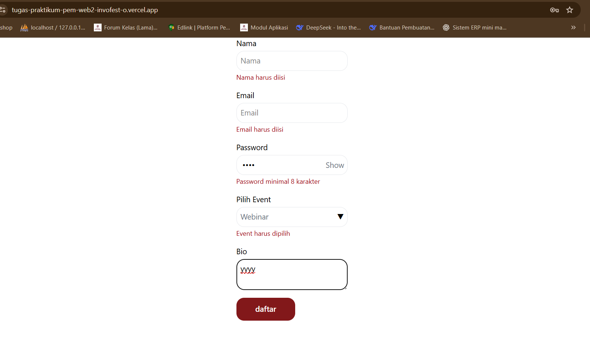
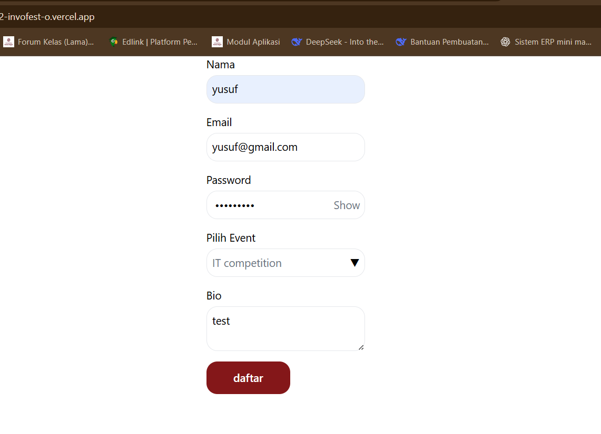
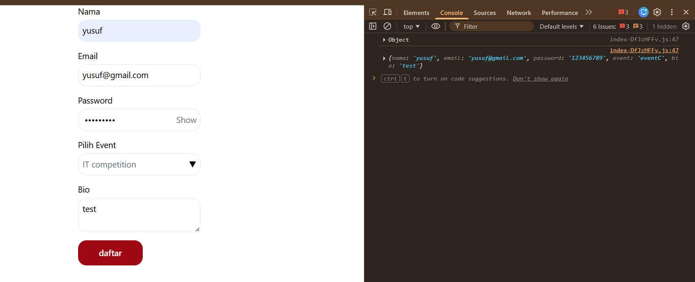
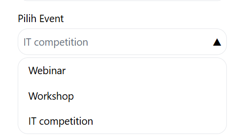

# Form pendaftaran event invofest
# Tampilan form validasi

pada setiap field wajib di isi jika tidak form akan menampilkan pesan error dan tidak valid saat klik tombol daftar

Pesan error yang muncul:
Nama harus diisi - jika field nama kosong
Email harus diisi - jika field email kosoong
Password minimal 8 karakter - jika password kurang dari 8 digit
Event harus dipilih - jika tidak memilih event
Bio maksimal 200 karakter - jika memasukkan bio lebih dari 200 karakter

# Form terisi dengan benar
contoh form yg sudah di isi dengan benar sebelum di submit

# Tampilan jika di inspect 
form sudah di isi dan klik tombol daftar, jika di inspect akan memunculkan data yg di masukkan

# Dropdown
Dropdown "Pilih Event" dibuat dengan 3 pilihan yaitu Webinar, Workshop, IT competition

